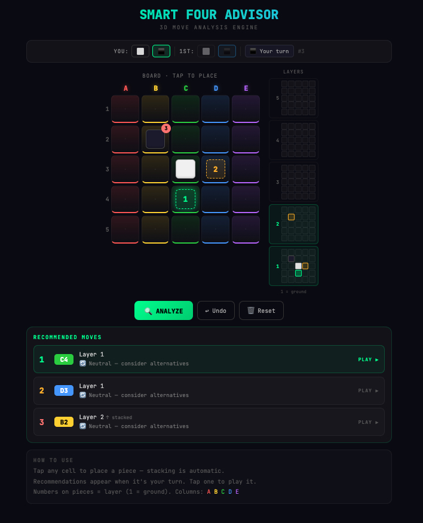

# Smart Four Advisor

A 3D move analysis engine for the [GiiKER Smart Four](https://shop-giiker.myshopify.com/products/smart-four-ai-featured-3-dimensional-electronic-4-in-a-row-connect-strategy-board-game) board game — built to help you beat the computer on hard mode.

**[Try it live →](https://www.mrchow.guru/smart-four-advisor/)**



Smart Four is a 3D twist on Connect Four played on a 5×5 grid where pieces stack up to 5 levels high. You can connect four in a row horizontally, vertically, diagonally across the board, straight up, or along any 3D diagonal. The computer AI is no joke, especially on hard mode. This advisor runs alongside your physical game and tells you exactly where to play.

## How It Works

1. **Mirror your game** — tap cells on the board to match what's happening on your physical Smart Four. Pieces auto-stack to the correct height.
2. **Get recommendations** — when it's your turn, the engine analyzes every legal move and highlights the top 3 options directly on the board. Tap a recommendation to play it.
3. **Watch for alerts** — the advisor warns you when the opponent is building toward a fork (two simultaneous winning threats that can't both be blocked).

The board uses color-coded columns (A=red, B=yellow, C=green, D=blue, E=purple) to match the physical game, and side layer panels show the full 3D state at each height so you can track threats across all five levels.

## What the Engine Does

The advisor uses a minimax search algorithm with alpha-beta pruning to evaluate positions 5 moves deep. On top of raw search, it runs specialized analysis:

**Fork detection** — the most important feature. A fork is a move that creates two winning threats at once. Since you can only block one per turn, a fork is essentially game over. The engine identifies moves that create forks (labeled 🔱) and prioritizes them above everything else.

**Opponent fork prevention** — for every candidate move, the engine simulates the opponent's best responses and checks whether any of them lead to a fork setup within 2 turns. Moves that walk into fork traps get penalized, even if they look strong in isolation.

**Fork disruption** — tracks how many "convergence cells" the opponent has (cells where multiple 2-in-a-row lines overlap). Moves that reduce that count get a bonus, so the advisor actively recommends breaking up the opponent's buildup before it becomes a problem.

**Danger alerts** — a yellow warning banner appears when the engine detects the opponent is converging on a fork, prompting you to prioritize defense over attack.

## Recommendation Labels

| Label | Meaning |
|-------|---------|
| 🏆 WINNING MOVE | Play here and you win |
| 🔱 FORK | Creates 2+ simultaneous threats — unstoppable |
| 🛡️ MUST BLOCK | Opponent wins next turn if you don't play here |
| 🛡️ DOUBLE THREAT | Opponent already has a fork — blocking but likely losing |
| 🛡️ Disrupts opponent's fork setup | Breaks up converging threats |
| 🔥 Strong attacking setup | High-scoring offensive move |
| ⚡ Builds toward multiple threats | Sets up future fork potential |
| 📐 Solid positional play | Good center control or board presence |
| 🔄 Neutral | Neither side gains much — consider alternatives |
| ⚠️ Defensive | Opponent has pressure, you're reacting |

## Strategy Tips

**Control the center.** C3 and adjacent cells give you access to the most winning lines in every direction. The engine accounts for this, but it's worth internalizing.

**Build on layer 1 first.** Ground-level pieces support everything above them. Stacking too early gives the opponent more base-level control.

**Set up forks, don't chase single threats.** A single 3-in-a-row is easy for the computer to block. Two at once isn't. The engine's fork detection is specifically designed to find these positions.

**Watch the side panels.** The layer views on the right show threats you might miss on the top-down board — especially vertical and 3D diagonal connections.

**Use Undo aggressively.** If the danger alert fires or you get forked, rewind a few moves and try a different line. The advisor works best as an iterative tool, not just a one-shot oracle.

## Development

```bash
npm install
npm run dev
```

Runs at `http://localhost:5173`. Built with React + Vite.
